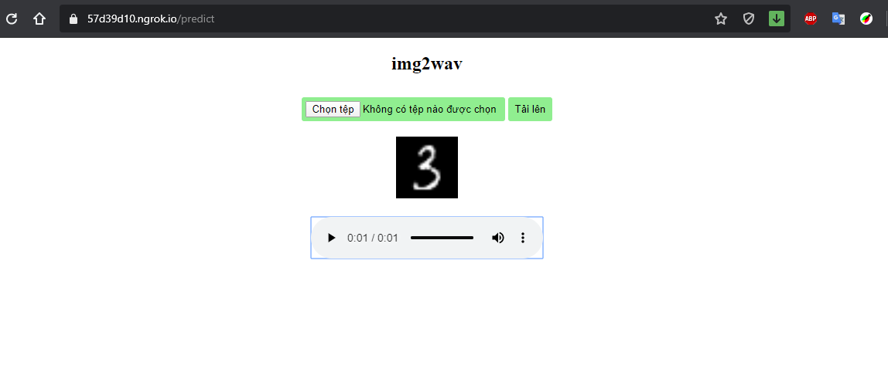

# flask-img2wav
**Image - Audio(Spectrogram) Translation using UNET (GAN Network), Flask Server, PHGI Phase Recovery From Spectrogram**  
+ Training model with MNIST dataset
+ Install `ltfatpy` (only support Linux, macOs):  
```
  sudo apt install libfftw3-dev liblapack-dev  
  pip install ltfatpy  
```
**Run server:**  
```
python flask_img2wav.py
```
and open `localhost:4040`  
  

